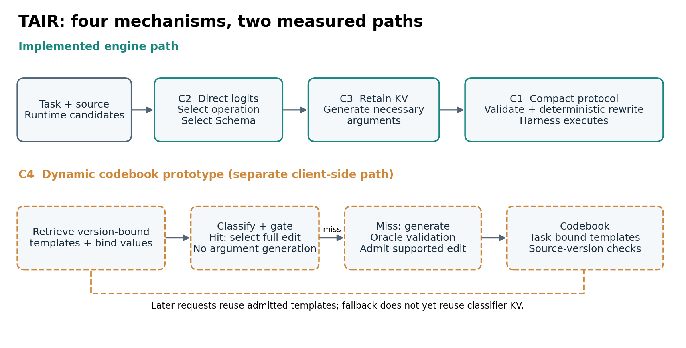
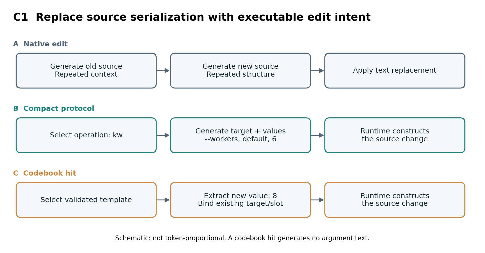
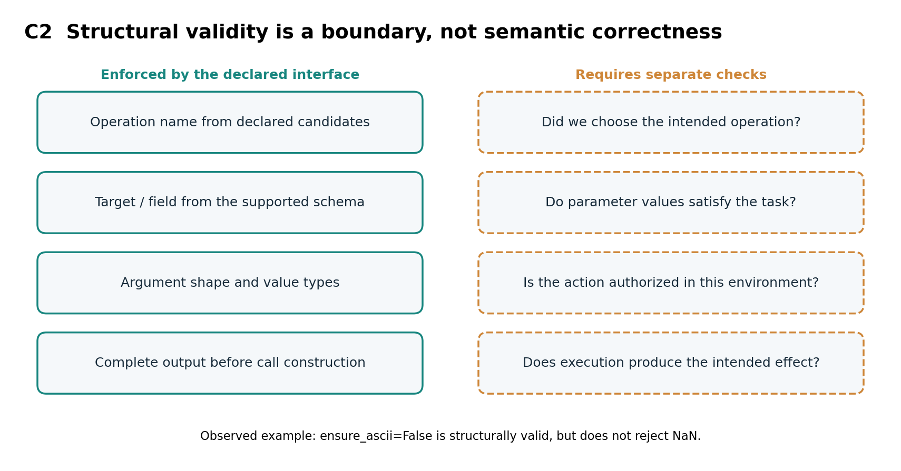
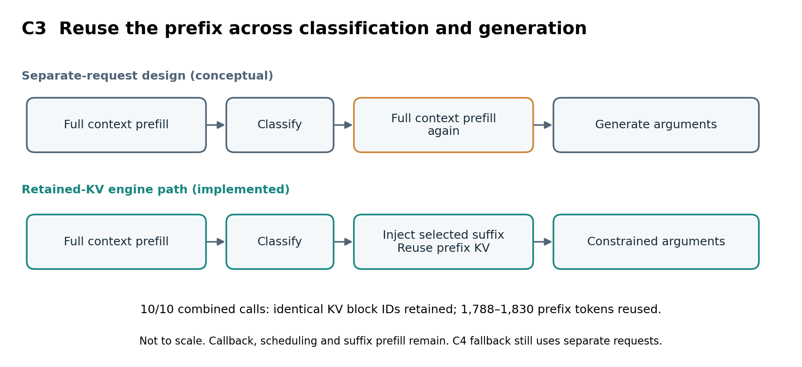
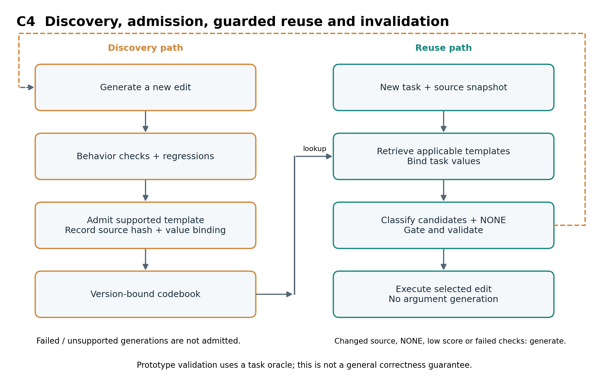
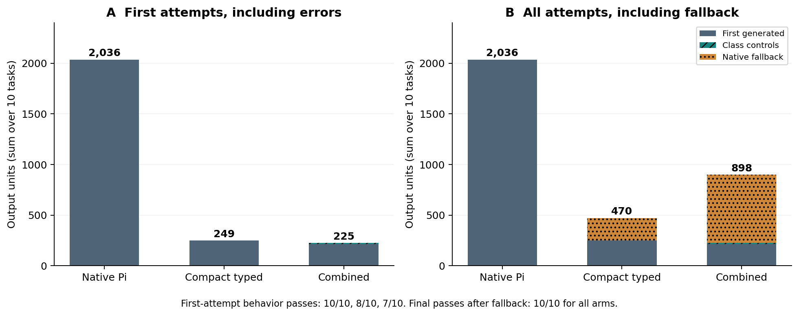
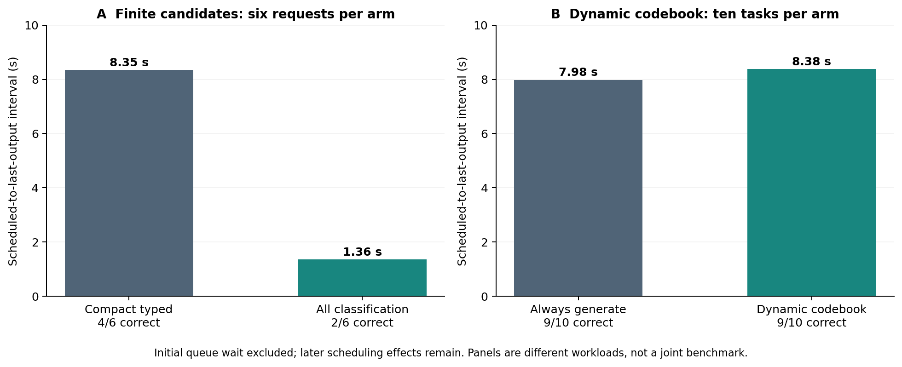
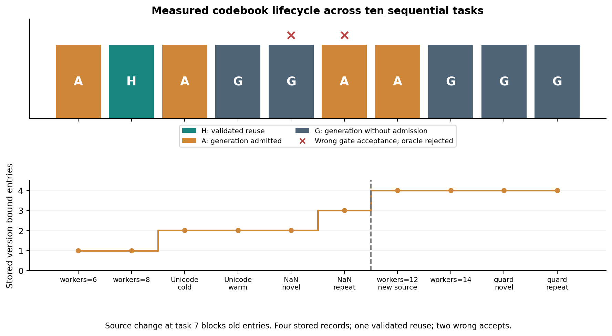
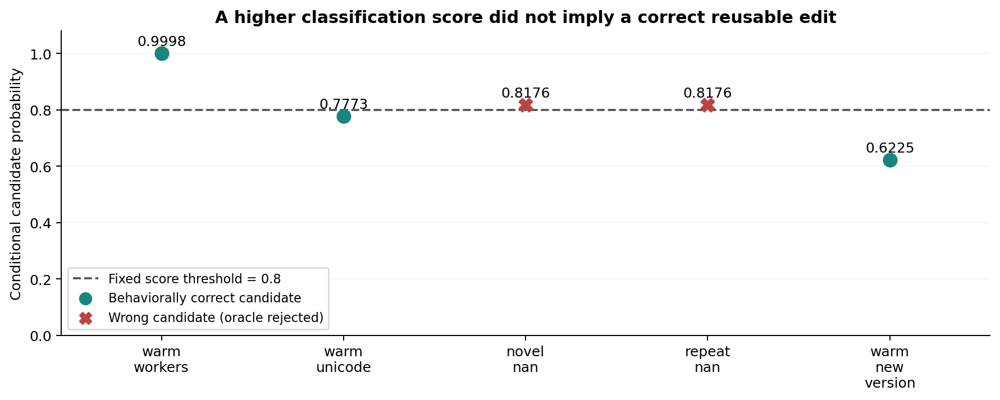
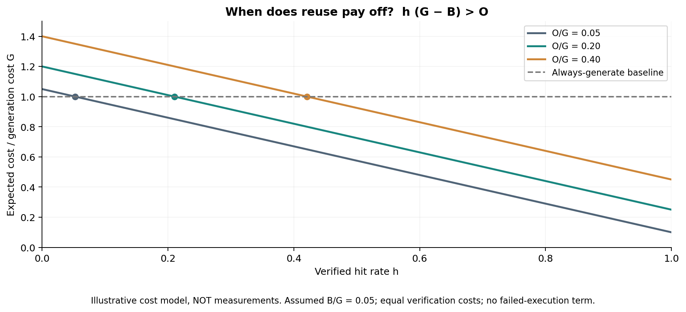

# TAIR: Typed Action Inference Runtime

Local interactive client: [pijit installation and usage](integrations/pijit/README.md).

**A technical report on four engineering contributions: compact operations, engine-side typed decisions, retained-KV continuation, and a dynamic codebook with generative fallback.**

[简体中文](README.zh-CN.md) · [Implementation](docs/ARCHITECTURE.md) · [Reproduction](docs/REPRODUCE.md) · [Experiment archive](docs/EXPERIMENTS.md)

**TAIR** stands for **Typed Action Inference Runtime**: a runtime for typed actions that combines classification, argument generation, compact protocols and action specialization.

[Project naming and compatibility](docs/NAMING.md).

*Research prototype · September 2026 · Reproducible engineering report, not a peer-reviewed publication.*

## Abstract

Agent tool calls mix decisions with content: selecting an operation is often a
finite choice, while its arguments may require open-ended generation. We investigate
whether moving this distinction into the inference runtime can reduce serial
output generation. TAIR combines four engineering mechanisms: a compact
operation protocol, direct candidate-logit classification with typed argument
constraints, classification-to-generation continuation using retained KV, and an
experimental codebook that learns reusable edits from validated generations.
On ten related editing tasks, the combined path reduces first-attempt generated
tokens from 2,036 to 215 (**89.4%**), while first-attempt behavioral correctness
falls from 10/10 to 7/10. Including fallback and classification controls leaves a
55.9% output reduction. A finite-candidate probe eliminates argument generation
and reduces the measured queue-excluded service interval from 8.35 s to 1.36 s,
but correctness falls from 4/6 to 2/6. A dynamic-codebook experiment demonstrates
one successful template reuse, yet increases aggregate service time by about 5%.
These results support reducing unnecessary autoregressive work, while identifying
semantic selection, applicability checking and miss cost as unresolved bottlenecks.

## 1. Motivation and research question

A conventional tool call asks a language model to serialize both the decision and
its data. For code editing, the response may also repeat source that the runtime
already possesses. This creates three potentially avoidable costs: representing
a finite decision as generated text, regenerating deterministic structure, and
recomputing context between a routing stage and argument generation.

Our question is: **which parts of an agent action can be selected or constructed
by software, leaving generation only for open-ended content?**

The objective is fewer serial model-output steps, not merely fewer characters in
a response. Autoregressive decoding already performs a vocabulary classification
at every step; renaming each token prediction “classification” does not accelerate
it. A useful classification must resolve a higher-level choice that replaces
multiple output tokens or removes a subsequent generation stage.

The four contributions below are contributions of this implementation and its
experiments. They are not claims that classification, grammars, cache reuse or
JIT-style specialization were invented here.



*Figure 1. The upper path combines C1–C3 in the measured engine/runtime integration.
C4 is a separate client-side prototype using engine classification. Its generative
fallback does not yet reuse the classification request's KV. [Vector PDF](assets/paper/en/01-architecture.pdf).*

## 2. System model and responsibilities

Let **x** denote task and context, **s** the current source/environment snapshot,
**O(x,s)** the available operations, and **S(o,s)** the argument schema for operation
o. A completed call consists of an operation and arguments; the model need not
serialize every part of that object.

| Component | Responsibility |
| --- | --- |
| Harness | Context assembly, permissions, tool execution and the agent loop |
| Candidate/schema builder | Runtime tool table, source targets, supported slots and value types |
| Inference engine | Candidate-logit selection, constrained argument generation and KV continuation |
| Protocol runtime | Snapshot checks, deterministic construction and supported source transformations |
| Codebook prototype | Version-bound templates, value binding, retrieval and admission records |

The Pi candidate experiments include `read`, `bash`, `edit`, `write`, `grep`,
`find`, `ls`, `powershell`, and `reply_user`. The structural-edit experiments use
operation candidates inside editing. Producing calls for these tools is not proof
of migrating the entire Pi agent loop or moving filesystem execution into vLLM.

## 3. Four engineering contributions

### C1. A compact, source-bound operation protocol

Instead of emitting old and new source blocks, the model describes an edit at the
level of the operation. The runtime resolves a source-derived target and constructs
the corresponding change. Supported operations include adding an argument,
changing a keyword, inserting a conditional return or exception, and catching an
exception around an existing statement.

```text
Task: change the default worker count to 6

Text replacement: generate the relevant oldText and newText source blocks
Compact protocol: ["kw", "--workers", "default", 6]
Combined path:    classify kw; generate [["--workers", "default", 6]]
Runtime:         locate the call and deterministically update its keyword
```

A source hash prevents applying the transformation to a stale snapshot. Typed
values avoid having to generate Python literal syntax for supported parameters;
the runtime handles the supported indentation and structural expansion. Generated
conditions and return expressions still require parsing and validation.

**Engineering benefit.** One high-level edit can replace a much larger source
replacement. This is the main source of the observed output reduction, rather
than removal of the outer JSON wrapper alone.

**Boundary.** The protocol cannot express arbitrary new code without an extension
or generation path. Lexical target retrieval can omit a relevant target, and a
syntactically valid edit can be behaviorally wrong.



*Figure 2. Three representations of a parameter edit. The boxes show responsibility, not measured token lengths; the codebook lane applies only after validated admission. [Vector PDF](assets/paper/en/05-protocol-compression.pdf).*

Implementation: [compact protocol](deploy/compact_structural_protocol.py),
[engine-facing edit schemas](deploy/direct_structural_protocol.py).

### C2. Engine-side categorical decisions and typed call construction

For candidate labels with token IDs **t₁ … tₖ**, the engine selects
**i\* = argmaxᵢ z(tᵢ | x)** from their logits. The V2 integration removes classification
rows from ordinary sampling, including in mixed batches, and transports the
selected ID as a control record. The engine chooses the corresponding operation
name and parameter schema; those names need not be generated and parsed from a
free-form tool-call wrapper.

Arguments are constrained during generation and validated before the final call
object is constructed. A truncated or invalid result is rejected. This places
a concrete structural boundary between model output and executable calls.

**Engineering benefit.** Call structure becomes a runtime responsibility, with
explicit candidates and typed interfaces rather than an unconstrained textual
agreement between a model and a harness.

**Boundary.** This does **not** guarantee the correct tool, meaningful argument
values or safe execution. Argument JSON still undergoes parsing. Candidate scores
are conditional on the offered choices, not calibrated correctness probabilities.
A control ID also requires model computation; it is not a zero-cost decision.



*Figure 3. Interface checks constrain call structure. Intent, authorization and execution behavior require separate evidence; the wrong-but-valid NaN edit is an observed counterexample. [Vector PDF](assets/paper/en/10-schema-boundary.pdf).*

Implementation: [vLLM hooks](deploy/vllm_direct_tools.py),
[source-patch installer](deploy/install_vllm_direct_tools.py).

### C3. Retained-KV classification-to-generation continuation

A naive two-stage system can read the same long context twice: once to classify,
then again to generate arguments. Our experimental engine path retains the scheduler
request and KV blocks across this boundary. After classification, the server
injects the selected continuation and resumes under its argument schema.

The implementation also retires paused V2 worker-slot metadata while retaining
scheduler KV ownership. This addresses a worker-slot exhaustion failure found in
live testing. Resume handling updates both the output budget and structured-output
state. Worker events expose the computed prefix and KV block IDs for verification.

**Engineering benefit.** Operation selection and parameter generation share the
already-computed prefix instead of requiring another full-context prefill.

**Boundary.** This is not a fused GPU kernel or uninterrupted scheduler step. A
server callback, another scheduling admission and continuation prefill remain.
Injected continuation tokens cost input computation even though they are not
counted as generated output. The live results concern a pinned V2 deployment;
V1 compatibility code has narrower evidence.



*Figure 4. Conceptual duplicated prefill versus the implemented retained-prefix path. The diagram is not time-proportional; callback and continuation costs remain. [Vector PDF](assets/paper/en/06-kv-continuation.pdf).*

Verification: [engine event audit](benchmarks/verify_deepseek_direct_engine.py),
[combined-edit audit](benchmarks/verify_direct_structural.py).

### C4. A dynamic codebook with generative fallback

We extend finite classification with an initially empty codebook. On a miss, the
model generates an edit. If it passes the experiment's validation and belongs to
the supported subset, the runtime admits a reusable template. Subsequent requests
retrieve applicable entries and classify among instantiated edits plus **NONE**.

```text
retrieve entries valid for the source snapshot
bind values that can be extracted deterministically
if there are candidates:
    classify candidates + NONE
    if the fixed gate accepts and validation passes:
        execute the selected edit without argument generation
otherwise:
    generate an edit and validate it
    if valid and supported, admit a version-bound template
```

For example, a validated `workers=6` generation becomes a template whose integer
slot can bind to a later request for `workers=8`. The current prototype supports
single keyword edits, keeps a source hash, and refuses stale entries. Integer
binding requires an unambiguous value in the task. Failed generations are not
admitted; other edit kinds can execute through generation without being cached.

**Engineering benefit.** Generation can expand the set of actions that later
requests may select directly. The JIT analogy is amortizing discovery cost through
guarded reuse, not compiling arbitrary prompts into proven-correct programs.

**Boundary.** Admission and rejection currently use hand-authored task tests—an
experimental oracle. The gate is uncalibrated, persistent restart recovery is not
implemented, and fallback uses a separate request with another prefill. This is
an early prototype, not a demonstrated general agent inference framework.



*Figure 5. Template admission and later reuse. The dashed route returns to generation on inapplicability or failed checks; current validation uses a task oracle. [Vector PDF](assets/paper/en/07-codebook-lifecycle.pdf).*

Implementation: [codebook](deploy/jit_codebook.py),
[sequential probe](benchmarks/probe_jit_codebook.py).

## 4. Evaluation methodology

The live engine experiments use DeepSeek-V4-Flash-Vision-Exp on **six RTX 5090s**,
TP2 × PP3, with vLLM `0.28.1rc1.dev137+g5ab628dd1` and its V2 runner. Model download
metadata revision `6821d6ad3681a4b137b066b76094fa82ebd0a380`, serving settings and
helper/configuration hashes are archived; the full weight set was not rehashed.
The service is shared, so queue and scheduling variability affect timings.

Experiments use temperature zero and fresh per-request cache salts. Editing tests
apply actual changes to a pristine snapshot, then run task checks and 17 original
regressions in an isolated namespace. Tasks are related, previously evaluated
scanner-project modifications, not a representative held-out software benchmark.

| Experiment | Workload | Comparison and accounting |
| --- | --- | --- |
| Combined structural edits | 10 tasks, one repetition per arm | Native Pi edit, compact typed protocol, C1–C3; at most one native fallback for experimental arms |
| Finite all-classification | 3 keyword tasks × 2 candidate orders | Compact, combined, full-edit candidate selection; no fallback |
| Dynamic codebook | 10 sequential tasks, paired arms | Always generate vs C4; cold calls, misses, wrong accepts and fallback retained |

We report generated tokens, control records and input tokens separately. First-
attempt totals retain incorrect attempts. Queue-excluded timing means the interval
from initial scheduling to last output; later scheduling effects remain. It is
not isolated GPU compute. Preparation is excluded in the first two studies;
the dynamic-codebook client timing includes its extra tokenization/SSH calls.
The studies have different prompts and acceptance rates and are not a controlled
factorial ablation of all four mechanisms. No confidence intervals or general
throughput claims are inferred from these small samples.

## 5. Results

### 5.1 Compact representation reduces output; fallback can dominate



*Figure 6. Ten-task totals. Classification controls are included as separate output
units. The first-attempt panel includes incorrect outputs; the fallback panel
includes their recovery cost. [Vector PDF](assets/paper/en/02-output-accounting.pdf).*

| Metric | Native Pi | Compact typed | Combined C1–C3 |
| --- | ---: | ---: | ---: |
| First-attempt generated tokens | 2,036 | 249 | 215 |
| First-attempt control records | 0 | 0 | 10 |
| First-attempt behavior passes | 10/10 | 8/10 | 7/10 |
| All output units, including fallback | 2,036 | 470 | 898 |
| All input + output units | 21,272 | 21,197 | 25,358 |
| Final behavior passes | 10/10 | 10/10 | 10/10 |

Combined first-attempt generation falls **89.4%** versus native; counting controls
gives 88.9%. Including fallback leaves **55.9% fewer output units**, but input plus
output increases **19.2%**. The combined path does not outperform the older compact
protocol overall. Its extra classification errors cost more than the operation-name
tokens it avoids. All ten combined calls nevertheless verify the intended sampler
bypass and complete KV-prefix reuse.

A separate long-output probe reduces generated tokens by only about **1%**. This
negative control supports a narrower interpretation: skipping wrappers helps much
less than replacing repeated source with high-level edits.

[Combined method and failures](docs/DEEPSEEK_COMBINED_STRUCTURAL_EXPERIMENT.md) ·
[Combined rows](results/experiments/pi-combined-structural-20260918-a/rows.jsonl) ·
[Long-output study](docs/DEEPSEEK_LONG_OUTPUT_EXPERIMENT.md)

### 5.2 Full classification removes decoding within a finite candidate space

When a complete edit is already in a finite table, the engine can select it with
one control ID and no argument text. The probe constructs candidates from source
slots, booleans/null and integers in the task or source; it is not arbitrary code
synthesis.

| Metric, six requests per arm | Compact typed | Classify + generate | All classification |
| --- | ---: | ---: | ---: |
| Generated tokens | 170 | 77 | 0 |
| Control records | 0 | 6 | 6 |
| Behavior passes | 4/6 | 5/6 | 2/6 |
| Queue-excluded service interval, sum | 8.35 s | Not comparably instrumented | 1.36 s |

The observed ratio is **6.14×**, with unequal correctness and a tiny workload.
The mechanism is removal of subsequent autoregressive steps; prefill and the
initial decision still cost computation. This is not a stable, same-quality speedup.



*Figure 7. Left: finite classification removes the decode tail at lower correctness.
Right: dynamic codebook misses outweigh its one successful reuse. Panels are
separate workloads and should not be compared as one experiment.
[Vector PDF](assets/paper/en/03-service-intervals.pdf).*

[Probe method](docs/ALL_CLASSIFICATION_PROBE.md) ·
[Finite-classification evidence](results/experiments/pi-all-classification-20260918-a/)

### 5.3 Dynamic admission and reuse work; net acceleration does not yet follow

| Metric, ten sequential tasks | Always generate | Dynamic codebook C4 |
| --- | ---: | ---: |
| Final behavior passes | 9/10 | 9/10 |
| Inference requests | 10 | 14 |
| Generated tokens | 194 | 182 |
| Control records | 0 | 5 |
| Input + output units | 17,006 | 22,944 |
| Queue-excluded service interval, sum | 7.982 s | 8.380 s |
| End-to-end task time, sum | 104.08 s | 137.01 s |

The codebook admits four version-bound records and achieves one correct reuse
from `workers=6` to `workers=8`. That pair needs zero generated arguments; its
service interval falls from 0.337 s to 0.273 s. However, aggregate service time
increases about **5%**, and observed client time increases **31.6%**. Low hit rate,
classification on misses, another prefill and client round trips consume the saving.

Five requests have applicable candidates. The fixed gate accepts three; **two
are wrong** and require oracle rejection. These are not successful cache hits.
Both arms ultimately pass 9/10, with all costs retained.



*Figure 8. Each task is marked by validated reuse (H), generation with admission (A), or generation without admission (G). Red crosses mark two wrong gate accepts before oracle rejection. Stored entry count includes older source versions. [Vector PDF](assets/paper/en/09-codebook-timeline.pdf).*

[JIT probe and implementation limits](docs/JIT_CODEBOOK_PROBE.md) ·
[JIT rows](results/experiments/pi-jit-codebook-20260918-b/rows.jsonl)

### 5.4 Reliability is not a scalar confidence threshold



*Figure 9. Five codebook classifications. Two incorrect NaN edits score about 0.818,
above the 0.8 gate; correct Unicode and workers candidates score about 0.777 and
0.622. The implemented gate also requires logprob margin ≥ 1.0. Correctness is
established retrospectively from behavior checks, not from the score.
[Vector PDF](assets/paper/en/04-gate-reliability.pdf).*

A high conditional score does not establish that the right action is present in
the retrieved set. Merely lowering the gate would admit more correct examples but
would not reject the higher-scoring wrong ones observed here.

Prompt design also matters. On three selected previous operation-classification
failures, removing mixed generation instructions changes correctness from 0/3 to
2/3. A socket-exception case remains wrong. This is a diagnostic ablation, not a
general accuracy estimate, and does not justify attributing every error to model
training. [Ablation evidence](results/experiments/pi-operation-prompt-20260918-a/).

## 6. Discussion: when can this accelerate inference?

Output savings become inference savings when avoided decode work exceeds the cost
of selection, additional prefill, validation and scheduling. For a simplified
codebook path with a verified hit rate **h**, generation cost **G**, bound-execution
cost **B**, and incremental lookup/classification/admission overhead **O**:

```text
Expected cost ≈ O + h B + (1 − h) G
Benefit over always generating requires: h (G − B) > O
```



*Figure 10. Analytical illustration, not experimental measurements. Curves assume B/G = 0.05 and three overhead ratios; dots mark the break-even hit rate. Real failures and unequal validation costs require additional terms. [Vector PDF](assets/paper/en/08-break-even-model.pdf).*

This is an explanatory cost model, not a fitted result; unequal verification,
failed cached executions and variable generation costs require additional terms.
It explains why a small output reduction can coexist with a slower system.

The next engineering targets are applicability checks and calibrated rejection,
cheaper candidate retrieval, engine-local tokenization, KV reuse on a codebook miss,
and broader template coverage. Each must be measured against both behavior and
complete execution cost. Dynamic admission must not turn one wrong generation
into many fast repeated errors.

## 7. Related work and scope of novelty

[OpenJev](https://github.com/TheoLeeCJ/openjev) demonstrates direct option-logit
readout for runtime-defined decisions and is the implementation inspiration for
our classification path. It does not disclose or reproduce the internal model
architecture of the closed Jev service; neither do we.

[vLLM / PagedAttention](https://arxiv.org/abs/2309.06180) addresses efficient serving
and KV-cache memory management. Our implementation builds on vLLM and changes a
specific classification/continuation execution path rather than proposing a new
serving engine or KV allocation algorithm.

[XGrammar](https://arxiv.org/abs/2411.15100) addresses efficient structured generation.
We use the deployed structured-output machinery for argument constraints; our
protocol also reduces what must be generated by moving deterministic construction
into the runtime. We do not claim to invent grammar-constrained decoding.

The contribution is the implemented combination and its audited behavior: compact
operation semantics, engine-managed categorical selection, retained-KV argument
continuation, and an experimentally evaluated admission/reuse loop. The JIT analogy
describes guarded reuse, not established equivalence to a compiler. These references
provide context, not an exhaustive prior-art or priority assessment.

## 8. Limitations and reproducibility

The workloads are small, related and previously inspected. Candidate orders,
prompt wording, shared-server load and model numerical behavior are incompletely
isolated. Schema validity is not semantic correctness; supported templates do not
cover arbitrary code. The dynamic gate is uncalibrated and uses an oracle for
admission/rejection. Full Pi-loop migration, production reliability and stable
throughput improvement have not been demonstrated. No weights or training changes
were made for the three studies emphasized here; earlier protocol-training
experiments are archived separately.

Frozen requests, responses, generated workspaces, source snapshots, failures and
checksums are retained. Source-hash/version checks and rejected runs are part of
the evidence. The pinned vLLM source patch is experimental, not an upstream plugin.
A development codebook run interrupted by a binding bug is preserved separately
and excluded from the complete measured run.

```bash
python -m venv .venv
. .venv/bin/activate
pip install -e '.[test]'
pytest -q
python benchmarks/verify_archive.py
python examples/compact_edit.py

# Rebuild all ten figures in English and Chinese without a model or GPU:
pip install -e '.[paper]'
python benchmarks/render_paper_figures.py
```

Figures are generated from frozen JSON/JSONL using Matplotlib; PNGs, editable SVGs
and vector PDFs are included in [assets/paper](assets/paper/). Their input hashes
and plotted values are recorded in [data.json](assets/paper/data.json). No synthetic
error bars or unmeasured benchmark points are added. Each README embeds its own language edition: [English figures](assets/paper/en/) and
[Chinese figures](assets/paper/zh-CN/). Both are rendered from identical data and layouts.
Chinese rendering requires Noto Sans CJK or WenQuanYi Zen Hei (for example, the
`fonts-noto-cjk` Linux package). All ten figures are embedded inline, rather than
being available only as download links.

See [live reproduction requirements](docs/REPRODUCE.md), [all experiments](docs/EXPERIMENTS.md),
and [source provenance](THIRD_PARTY.md). Maintained runners use
`TAIR_ENGINE_HOST` and `PI_PACKAGE_ROOT`; frozen records retain historical paths.
Ordinary verification does not install a vLLM patch, restart a server or run a GPU
benchmark. This report update does not change the archived experiments.

| Directory | Contents |
| --- | --- |
| `deploy/` | Engine hooks, compact protocols, codebook and patch installer |
| `benchmarks/` | Experiments, fixtures, analysis and figure reproduction |
| `integrations/pi/` | Adapters for separately installed Pi tools |
| `tests/` | Protocol boundaries and engine integration tests |
| `results/experiments/` | Frozen successes, failures, traces and checksums |
| `src/openjev_phase1/` | Attributed helpers retained for historical runners |

MIT licensed with upstream notices preserved: [LICENSE](LICENSE).
Models and external dependencies retain their own terms; weights and credentials
are not distributed. Code and report remain a research prototype.
