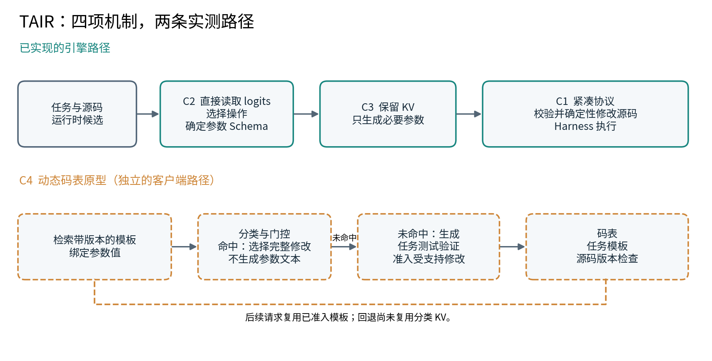
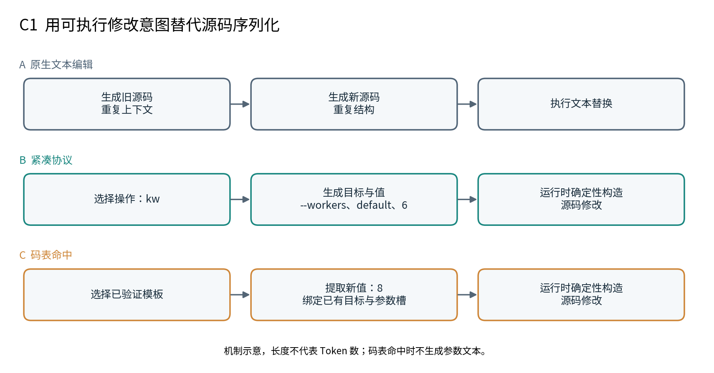
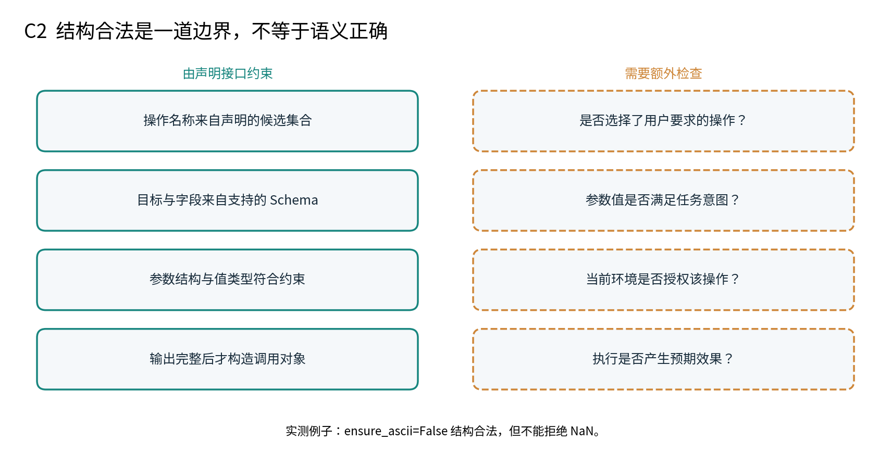
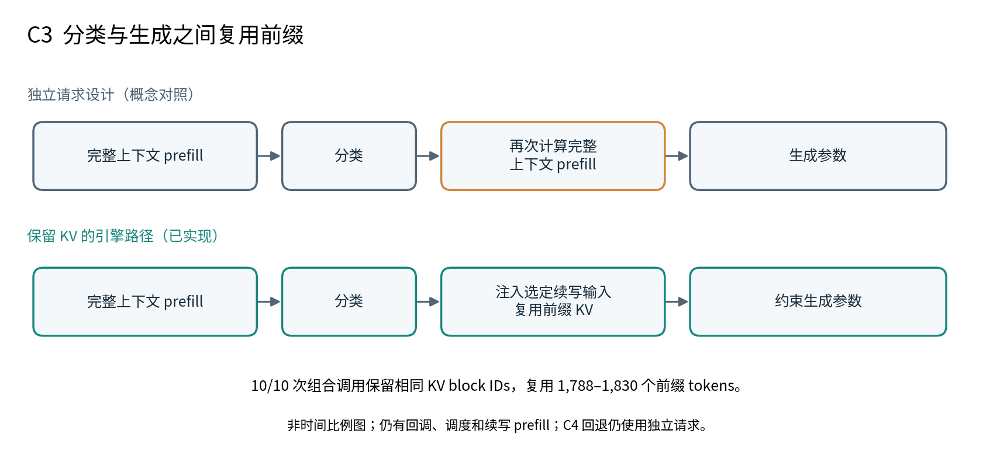
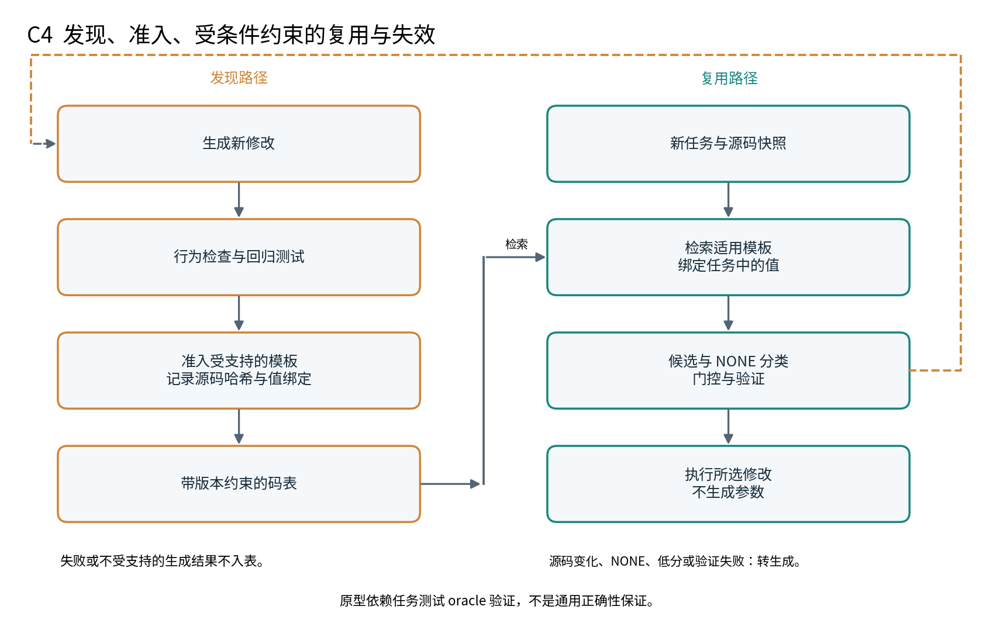
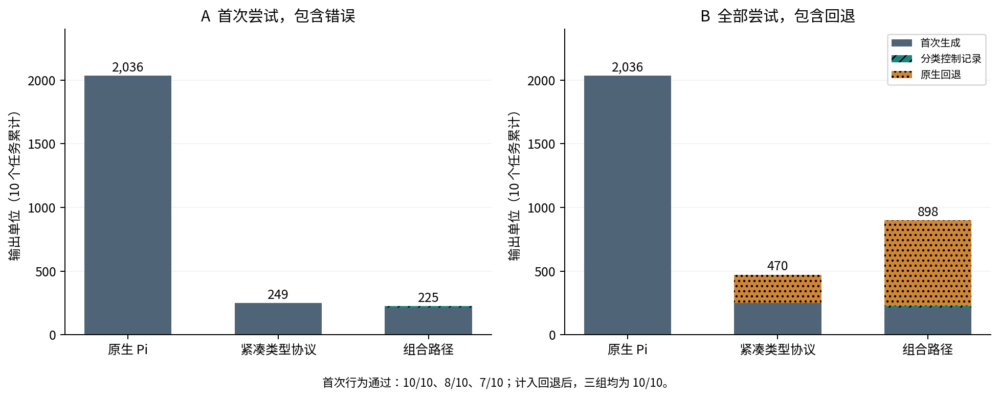
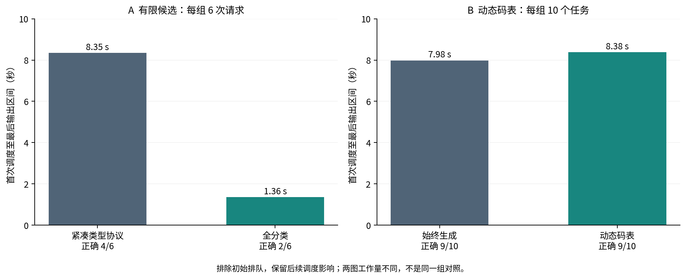
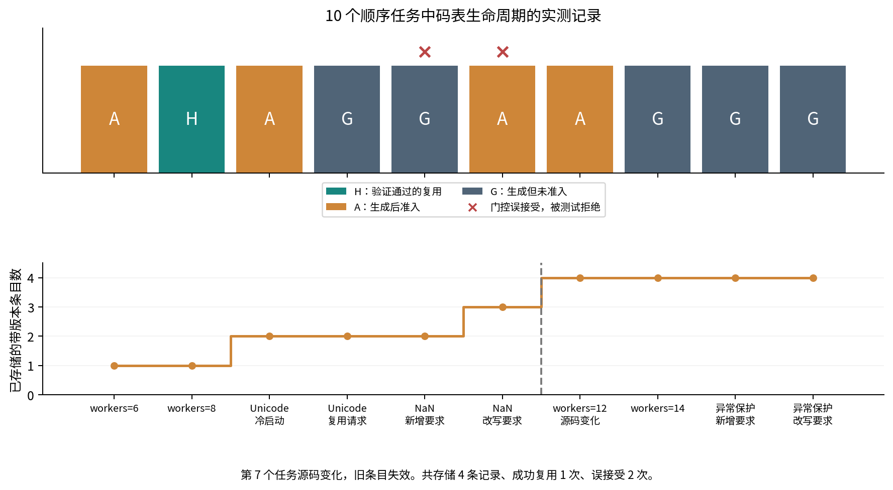
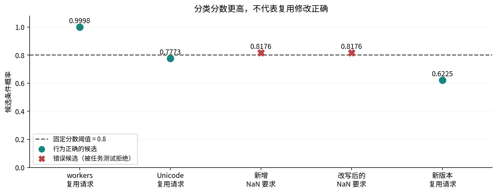
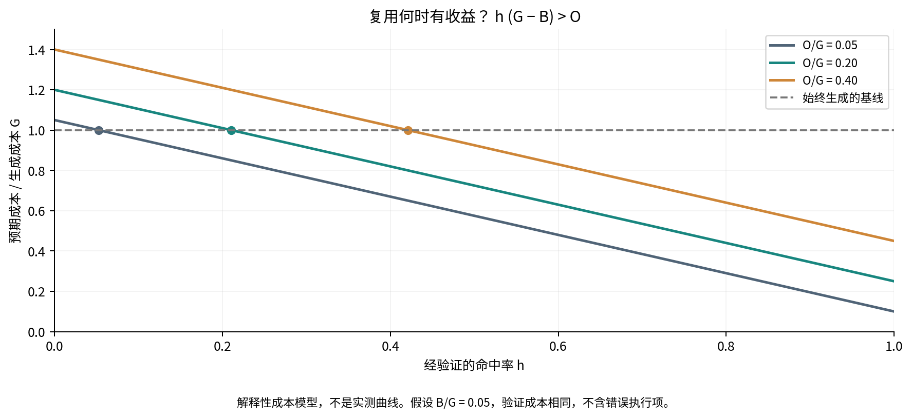

# TAIR：类型化动作推理运行时

本地交互客户端：[pijit 安装与使用](integrations/pijit/README.md)（紧凑源码编辑目前支持 Python）。

最新研究进展（2026-09-21）：[加速研究总览、负面结果与社区技术路线](docs/ACCELERATION_RESEARCH_STATUS.md)。下方技术报告保留原实验口径；通用端到端加速尚未证实。

**四项工程贡献的技术报告：紧凑操作、引擎侧类型决策、KV 连续执行，以及带生成回退的动态码表。**

[English](README.md) · [实现细节](docs/ARCHITECTURE.md) · [复现](docs/REPRODUCE.md) · [实验档案](docs/EXPERIMENTS.md)

**TAIR** 全称为 **Typed Action Inference Runtime（类型化动作推理运行时）**：将分类、参数生成、紧凑协议与动作特化组合在运行时中。

[项目命名与兼容说明](docs/NAMING.md)。

*研究原型 · 2026 年 9 月 · 可复核的工程技术报告，尚非经过同行评审的论文。*

## 摘要

Agent 工具调用同时包含决策与内容：选择操作往往是有限分类，参数却可能需要开放式生成。
我们研究将这种区分交给推理运行时，能否减少串行输出生成。TAIR 组合了四个
工程机制：紧凑操作协议、带类型参数约束的候选 logits 直接分类、保留 KV 的分类到生成
续写，以及从验证过的生成结果中积累可复用编辑的动态码表。在 10 个相关修改任务中，
组合路径的首次实际生成量从 2,036 降到 215 tokens，减少 **89.4%**，但首次行为正确率
从 10/10 降到 7/10。计入回退及分类控制记录后，输出仍减少 55.9%。有限候选实验省去
参数生成，将排除初始排队的服务内区间从 8.35 秒降到 1.36 秒，但正确率从 4/6 降到
2/6。动态码表实验完成了一次成功模板复用，整体服务内时间却增加约 5%。这些结果验证了
减少非必要自回归计算的机制，同时揭示了语义选择、适用性判断和未命中成本的瓶颈。

## 1. 动机与研究问题

传统工具调用让模型同时序列化决策和数据。对于代码修改，响应还可能重复运行时已经持有
的源码，由此产生三类潜在冗余：用生成文本表达有限决策、重新生成确定性结构，以及在
路由和参数生成之间重复计算上下文。

我们的研究问题是：**Agent 动作的哪些部分可以选择或由程序构造，从而只为开放内容保留生成？**

目标是减少串行模型输出步骤，而不只是减少字符。自回归解码本来就在每一步进行词表分类；
把 token 预测改名为“分类”并不会加速。有效的分类应解决更高层的选择，替代多个输出
tokens，或直接省去后续生成阶段。

下文四项贡献指本项目的工程实现与实验贡献，不声称分类、语法约束、缓存复用或 JIT
式特化由我们首次提出。



*图 1：上方是 C1–C3 的引擎与运行时集成路径；C4 是调用引擎分类的独立客户端原型。
其生成回退目前尚未复用分类请求的 KV。[矢量 PDF](assets/paper/zh-CN/01-architecture.pdf)。*

## 2. 系统模型与职责

用 **x** 表示任务与上下文，**s** 表示源码或环境快照，**O(x,s)** 表示可用操作，
**S(o,s)** 表示操作 o 的参数 Schema。完整调用由操作和参数构成，但其中并非每一部分
都必须由模型序列化输出。

| 组件 | 职责 |
| --- | --- |
| Harness | 上下文、权限、工具执行和 Agent 循环 |
| 候选与 Schema 构建器 | 运行时工具表、源码目标、参数槽及值类型 |
| 推理引擎 | 候选 logits 选择、约束参数生成及 KV 续写 |
| 协议运行时 | 快照检查、确定性构造和受支持的源码变换 |
| 码表原型 | 版本绑定模板、值绑定、检索和准入记录 |

Pi 工具候选实验包括 `read`、`bash`、`edit`、`write`、`grep`、`find`、`ls`、
`powershell` 和 `reply_user`；结构化编辑实验则使用编辑内部的操作候选。能产生这些
调用，不等于已迁移完整 Pi 循环，也不意味着文件系统执行被移进了 vLLM。

## 3. 四项工程贡献

### C1. 绑定源码的紧凑操作协议

模型在操作层表达修改，运行时解析源码导出的目标并构造变换，避免输出整段新旧源码。
当前操作包括添加参数、修改关键字、插入条件返回或抛异常，以及捕获已有语句的异常。

```text
任务：把默认 workers 改为 6

文本替换：生成相关源码的 oldText 和 newText
紧凑协议：["kw", "--workers", "default", 6]
组合路径：分类选 kw；生成 [["--workers", "default", 6]]
运行时：  定位调用，确定性修改其关键字参数
```

源码哈希阻止对过期快照应用修改。类型化值使模型不必为受支持参数生成 Python 字面量
语法；运行时处理相应缩进和结构展开。生成的条件和返回表达式仍需要解析与校验。

**工程收益。** 一条高层指令可以替代较长的源码替换，这是编辑任务显著节省输出的主要
来源；收益不只是省掉外层 JSON。

**边界。** 超出协议表达能力的新代码仍需扩展或生成。词法目标检索可能漏掉正确目标，
语法合法的编辑也可能行为错误。



*图 2：参数编辑的三种表达方式。方框表示职责，不代表实测 Token 长度；码表路径只适用于经过验证准入的模板。 [矢量 PDF](assets/paper/zh-CN/05-protocol-compression.pdf).*

实现：[紧凑协议](deploy/compact_structural_protocol.py)、
[面向引擎的编辑 Schema](deploy/direct_structural_protocol.py)。

### C2. 引擎侧分类决策与类型化调用构造

对候选标签 token IDs **t₁ … tₖ**，引擎从 logits 中选择
**i\* = argmaxᵢ z(tᵢ | x)**。V2 集成将分类行从普通采样中移除，包括与普通请求混批时，
再通过内部控制记录传递所选 ID。引擎确定操作名称和参数 Schema，模型不必先在自由文本
调用外壳里输出这些名称，再让 Harness 解析出来。

参数在生成过程中受约束，完整输出经校验后才能构造调用对象；截断或不合法的结果被拒绝。
这在模型输出与可执行调用之间建立了具体的结构边界。

**工程收益。** 调用结构成为运行时职责，工具与参数接口由候选和类型定义，而不是仅靠
模型与 Harness 之间的文本约定。

**边界。** 不保证工具选对、参数有意义或执行安全。参数 JSON 仍需解析；候选分数是给定
候选集合下的条件分数，不是经过校准的正确率。控制 ID 也需要模型计算，并非零成本决策。



*图 3：接口检查约束调用结构；意图、权限和执行效果仍需单独验证。NaN 任务中“结构合法但行为错误”的编辑来自实际观测。 [矢量 PDF](assets/paper/zh-CN/10-schema-boundary.pdf).*

实现：[vLLM hooks](deploy/vllm_direct_tools.py)、
[源码补丁安装器](deploy/install_vllm_direct_tools.py)。

### C3. 保留 KV 的分类—生成连续执行

简单的两阶段实现可能重复读取长上下文：一次用于分类，一次用于生成参数。我们的实验
路径在阶段切换时保留 scheduler 请求及 KV 块，再注入选定的续写输入，在对应参数 Schema
下恢复生成。

实现还在暂停边界释放 V2 worker 槽位元数据，但保留 scheduler 对 KV 的持有关系，解决了
实测发现的 worker 槽位耗尽问题。恢复逻辑同时更新输出预算和结构化输出状态；引擎事件
记录已计算前缀及 KV block IDs，供逐请求核查。

**工程收益。** 操作选择和参数生成共享已经计算的前缀，避免再次完整 prefill。

**边界。** 这不是融合后的单个 GPU kernel，也不是无中断的调度步骤：仍有服务端回调、
再次调度和续写 prefill。注入 tokens 虽不算生成输出，仍消耗输入计算。现场证据针对固定
版本的 V2 部署，V1 兼容代码的证据范围更窄。



*图 4：概念上的重复 prefill 与已实现的前缀复用。图形不按耗时比例绘制，回调和续写开销仍然存在。 [矢量 PDF](assets/paper/zh-CN/06-kv-continuation.pdf).*

验证：[引擎事件核查](benchmarks/verify_deepseek_direct_engine.py)、
[组合编辑核查](benchmarks/verify_direct_structural.py)。

### C4. 带生成回退的动态码表

在有限分类之上，我们加入初始为空的码表。未命中时先生成编辑；通过实验验证且属于支持
范围的结果，才准入为可复用模板。后续请求检索适用条目，在实例化编辑与 **NONE** 之间分类。

```text
检索对当前源码快照有效的条目
确定性绑定能够从任务提取的参数值
如果存在候选：
    分类选择候选或 NONE
    如果固定门控接受且验证通过：
        执行所选编辑，不生成参数
否则：
    生成编辑并验证
    如果合法且受支持，准入为绑定版本的模板
```

例如，通过验证的 `workers=6` 被转换成带整数槽的模板，后续可以绑定 `workers=8`。
原型只支持单条关键字编辑，保留源码哈希并拒绝过期条目；整数绑定要求任务中数值明确且
无歧义。失败生成不入表，其他编辑种类仍可通过生成执行，但不会缓存。

**工程收益。** 生成能够扩充未来可直接分类执行的动作集合。JIT 类比指的是通过带条件的
复用摊薄首次发现成本，不是将任意 Prompt 编译成被证明正确的程序。

**边界。** 目前准入与拒绝使用手写任务测试，即实验 oracle；门控未经校准，未实现跨进程
重启恢复，回退仍是独立请求并需要再次 prefill。因此它是早期原型，不是已经验证的通用
Agent inference framework。



*图 5：模板准入及后续复用。虚线表示不适用或检查失败时转回生成；原型验证仍依赖任务测试 oracle。 [矢量 PDF](assets/paper/zh-CN/07-codebook-lifecycle.pdf).*

实现：[码表](deploy/jit_codebook.py)、[顺序任务探测](benchmarks/probe_jit_codebook.py)。

## 4. 实验方法

现场实验使用 **6 张 RTX 5090** 上的 DeepSeek-V4-Flash-Vision-Exp，TP2 × PP3，
vLLM `0.28.1rc1.dev137+g5ab628dd1` 的 V2 runner。模型下载元数据 revision
`6821d6ad3681a4b137b066b76094fa82ebd0a380`、部署设置及引擎辅助模块和模型配置哈希均已
记录，但没有重新计算全部权重的哈希。服务与其他请求共享，排队和调度会影响耗时。

温度为零，每个请求使用新的 cache salt。编辑会实际应用于原始快照，并在隔离 namespace
内执行任务检查和 17 项原有回归测试。这些是相关、已评估的扫描器项目修改，不是具有
代表性的留出软件工程测试集。

| 实验 | 工作量 | 对照及成本统计 |
| --- | --- | --- |
| 组合结构化编辑 | 10 个任务，各方法一轮 | 原生 Pi、紧凑类型协议、C1–C3；实验组最多一次原生回退 |
| 有限候选全分类 | 3 个参数任务 × 2 种候选排列 | 紧凑、组合、完整编辑分类；不回退 |
| 动态码表 | 10 个顺序任务，两组配对 | 始终生成与 C4；保留冷启动、未命中、误接受和回退 |

分别统计实际生成 tokens、分类控制记录和输入 tokens。首次结果包含错误尝试。“排除
排队”的区间指首次调度到最后输出，仍包含准入后的调度干扰，不是独占 GPU 计算时间。
前两组不计准备阶段；动态码表客户端计时包含额外分词和 SSH。各实验提示词和正确率不同，
并非四个机制的受控全因子消融；这些小样本不支持置信区间或通用吞吐量结论。

## 5. 实验结果

### 5.1 紧凑表示减少输出，但回退可能主导总成本



*图 6：10 个任务累计值。分类控制记录单独计入输出单位。左图包含错误的首次输出，
右图包含相应回退成本。[矢量 PDF](assets/paper/zh-CN/02-output-accounting.pdf)。*

| 指标 | 原生 Pi | 紧凑类型协议 | 组合 C1–C3 |
| --- | ---: | ---: | ---: |
| 首次实际生成 tokens | 2,036 | 249 | 215 |
| 首次分类控制记录 | 0 | 0 | 10 |
| 首次行为正确 | 10/10 | 8/10 | 7/10 |
| 包含回退的全部输出单位 | 2,036 | 470 | 898 |
| 全部输入加输出单位 | 21,272 | 21,197 | 25,358 |
| 最终行为正确 | 10/10 | 10/10 | 10/10 |

组合版首次生成量相对原生减少 **89.4%**，含控制记录减少 88.9%；计入回退后输出减少
**55.9%**，但输入加输出增加 **19.2%**。组合版整体未胜过旧紧凑协议：分类错误的回退
成本超过了省掉操作名称的收益。不过全部 10 次调用均验证了预期的分类采样旁路与完整
KV 前缀复用。

独立的长输出实验仅节省约 **1%** 生成 tokens。这个负向对照支持更窄的结论：省调用
外壳的收益，远小于用高层编辑意图替代重复源码。

[组合方法与失败](docs/DEEPSEEK_COMBINED_STRUCTURAL_EXPERIMENT.md) ·
[逐条数据](results/experiments/pi-combined-structural-20260918-a/rows.jsonl) ·
[长输出实验](docs/DEEPSEEK_LONG_OUTPUT_EXPERIMENT.md)

### 5.2 有限候选空间内，全分类可以省掉参数解码

当完整修改已经在有限表中，引擎只需选择一个控制 ID，不需要输出参数文本。候选由源码
参数槽、布尔值、null，以及源码或任务里的整数构造，不是任意代码合成。

| 每组 6 次请求 | 紧凑类型协议 | 分类＋生成 | 全分类 |
| --- | ---: | ---: | ---: |
| 实际生成 tokens | 170 | 77 | 0 |
| 控制记录 | 0 | 6 | 6 |
| 行为正确 | 4/6 | 5/6 | 2/6 |
| 排除初始排队的服务内区间累计 | 8.35 秒 | 无同口径埋点 | 1.36 秒 |

本轮区间比值为 **6.14 倍**，但正确率不同且样本很小。机制是省掉首次预测之后的自回归
步骤，而 prefill 与首次决策仍有成本。这不是稳定、同质量的加速结论。



*图 7：左侧全分类在正确率降低的同时省掉后续 Decode；右侧动态码表的未命中成本超过
一次成功复用的节省。两个子图属于不同工作量，不能当作同一实验横向比较。
[矢量 PDF](assets/paper/zh-CN/03-service-intervals.pdf)。*

[探测方法](docs/ALL_CLASSIFICATION_PROBE.md) ·
[有限分类证据](results/experiments/pi-all-classification-20260918-a/)

### 5.3 动态准入和复用已运行，但整体尚未加速

| 10 个顺序任务 | 始终生成 | 动态码表 C4 |
| --- | ---: | ---: |
| 最终行为正确 | 9/10 | 9/10 |
| 推理请求数 | 10 | 14 |
| 实际生成 tokens | 194 | 182 |
| 控制记录 | 0 | 5 |
| 输入加输出单位 | 17,006 | 22,944 |
| 排除初始排队的服务内区间累计 | 7.982 秒 | 8.380 秒 |
| 实际任务耗时累计 | 104.08 秒 | 137.01 秒 |

码表准入了 4 条带版本记录，并将 `workers=6` 模板成功复用于 `workers=8`。该次复用
没有生成参数，服务内区间从 0.337 秒降到 0.273 秒。然而整体服务内时间增加约 **5%**，
实测客户端耗时增加 **31.6%**。低命中率、未命中时的分类、再次 prefill 和客户端往返
抵消了节省。

5 个请求存在候选并进行了分类，固定门控接受 3 次，其中 **2 次错误**，需要 oracle
拒绝。它们不是成功缓存命中。两组最终都是 9/10 正确，成本均完整保留。



*图 8：逐任务标记成功复用 H、生成并准入 A、生成但未准入 G。红叉是被测试拒绝前的两次门控误接受；条目总数包含旧源码版本的记录。 [矢量 PDF](assets/paper/zh-CN/09-codebook-timeline.pdf).*

[JIT 实验及边界](docs/JIT_CODEBOOK_PROBE.md) ·
[JIT 逐条数据](results/experiments/pi-jit-codebook-20260918-b/rows.jsonl)

### 5.4 可靠性不能由单一置信度阈值代表



*图 9：5 次码表分类。两个错误 NaN 修改约为 0.818，高于 0.8 阈值；正确的 Unicode
与 workers 候选约为 0.777 和 0.622。实际门控还要求 logprob margin ≥ 1.0。
图中正确性来自事后的行为验证，而不是模型分数。
[矢量 PDF](assets/paper/zh-CN/04-gate-reliability.pdf)。*

条件分数高不能证明候选集合里包含正确动作。降低阈值可以多接受一些正确例子，却不能
拒绝这些得分更高的错误例子。

提示词也影响结果。在此前 3 个分类失败用例上，移除混合的生成指令后，正确率从 0/3
变成 2/3，socket 异常处理仍选错。这是诊断性消融，不是总体准确率估计，也不能把全部
错误直接归因于训练。[消融证据](results/experiments/pi-operation-prompt-20260918-a/)。

## 6. 讨论：什么情况下能加速？

只有省掉的 Decode 超过选择、额外 prefill、验证与调度成本，输出节省才会成为推理节省。
对简化码表路径，设经验证的命中率为 **h**，生成成本为 **G**，绑定执行成本为 **B**，
新增的检索、分类及准入开销为 **O**：

```text
平均成本 ≈ O + h B + (1 − h) G
优于始终生成需要：h (G − B) > O
```



*图 10：分析性示意，不是实测曲线。假设 B/G = 0.05，展示三种额外开销比例；圆点是收支平衡的命中率。实际错误与不等的验证成本需要额外项。 [矢量 PDF](assets/paper/zh-CN/08-break-even-model.pdf).*

这只是解释性成本模型，不是实验拟合。验证成本不等、错误缓存执行和变化的生成成本都
需要额外项；它解释了为什么输出略少，系统却更慢。

后续工程重点是适用性检查、经过校准的拒绝机制、更便宜的候选检索、引擎内分词、未命中
时复用分类 KV，以及扩大模板覆盖。每一项都需要同时测量行为正确率和完整执行成本。
动态准入不能把一次错误生成变成许多次快速重复错误。

## 7. 相关工作与创新范围

[动作码表与 Agent 重放研究](docs/AGENT_REUSE_RESEARCH.md) 补充了
ToolkenGPT／ToolGen（离散工具 token）、AgentRR（带检查的重放）、
Agent Workflow Memory／Voyager（工作流与技能复用）和 LLMCompiler／SGLang
（执行开销优化）的论文与代码入口，区分实现差异、完整 Agent 实验证据和后续计划。
扩大 schema 不会自动教会未训练模型新动作编号的含义；编辑缓存命中也不等于整个任务加速。

[OpenJev](https://github.com/TheoLeeCJ/openjev) 展示了面向运行时决策的候选 logits
直接读取，是本项目分类路径的实现启发。它没有披露或复现闭源 Jev 的内部模型架构，
我们也不对此作推断。

[vLLM / PagedAttention](https://arxiv.org/abs/2309.06180) 研究高效服务与 KV 缓存
内存管理。我们依托 vLLM 修改特定分类与续写路径，并未提出新的通用推理引擎或 KV
分配算法。

[XGrammar](https://arxiv.org/abs/2411.15100) 研究高效结构化生成。我们使用部署中的
结构化输出能力约束参数，同时通过协议将确定性构造交给程序，减少需要生成的内容，
不声称发明语法约束解码。

本项目的贡献是这些机制的工程组合和可审计执行：紧凑操作语义、引擎管理的分类、保留
KV 的参数续写，以及经过实验的准入与复用循环。JIT 类比表示带条件的复用，不是已证明
等价于编译器。这些引用用于说明背景，不是完整的现有技术检索或首创性认定。

## 8. 局限与复现

任务规模小、相关且已被查看；候选顺序、提示词、共享负载和数值变化尚未充分隔离。
Schema 合法不等于语义正确，模板不能覆盖任意代码。动态门控未经校准，准入与拒绝依赖
实验 oracle。完整 Pi 循环迁移、生产可靠性和稳定吞吐提升尚未验证。本文重点讨论的
三组实验没有改变模型权重或进行训练，早期协议训练实验另有存档。

冻结档案保留请求、响应、生成工作区、源码快照、失败与校验和。版本检查和被拒绝的
尝试同样属于证据。固定版本 vLLM 源码补丁是实验实现，不是上游插件。因参数绑定 bug
中断的码表开发运行也单独保留，未计入完整实验结果。

```bash
python -m venv .venv
. .venv/bin/activate
pip install -e '.[test]'
pytest -q
python benchmarks/verify_archive.py
python examples/compact_edit.py

# 不需要模型或 GPU，重新生成十组中英文图：
pip install -e '.[paper]'
python benchmarks/render_paper_figures.py
```

图由 Matplotlib 从冻结 JSON/JSONL 生成，PNG、可编辑 SVG 和矢量 PDF 位于
[assets/paper](assets/paper/)，输入哈希与绘图数值记录在 [data.json](assets/paper/data.json)。
不添加虚构误差线或未测量的数据点。[英文图](assets/paper/en/)与[中文图](assets/paper/zh-CN/)分别内嵌到对应 README，
两套图使用相同数据和布局。中文渲染需要 Noto Sans CJK 或文泉驿正黑字体，例如 Linux
的 `fonts-noto-cjk` 包。十张图均直接显示在正文，而不只是提供下载链接。

参见[现场复现要求](docs/REPRODUCE.md)、[全部实验](docs/EXPERIMENTS.md)及
[来源说明](THIRD_PARTY.md)。运行脚本使用 `TAIR_ENGINE_HOST` 与 `PI_PACKAGE_ROOT`；
冻结记录保留历史路径。常规检查不会安装 vLLM 补丁、重启服务或运行 GPU 实验。
本次报告更新不改写历史实验记录。

| 目录 | 内容 |
| --- | --- |
| `deploy/` | 引擎 hook、紧凑协议、码表和补丁安装器 |
| `benchmarks/` | 实验、fixture、分析和图件生成 |
| `integrations/pi/` | 对独立安装 Pi 工具的适配 |
| `tests/` | 协议边界与引擎集成测试 |
| `results/experiments/` | 冻结的成功、失败、事件与校验和 |
| `src/openjev_phase1/` | 为历史实验保留的有来源声明的辅助代码 |

采用 MIT 许可并保留上游声明，见 [LICENSE](LICENSE)。模型及外部依赖保留各自许可；
仓库不分发权重和凭据。代码与报告目前仍属于研究原型。
